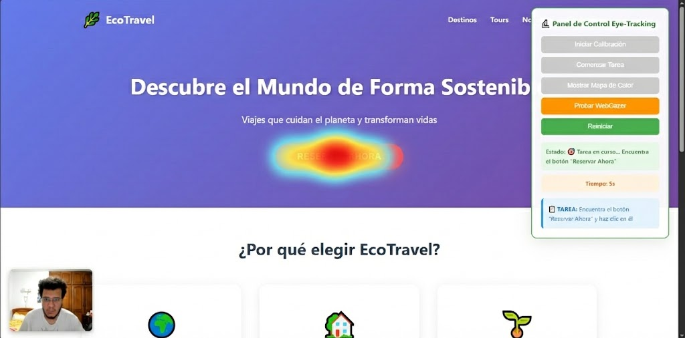

**Universidad:** Universidad Particular Internacional SEK
**Carrera:** Ingeniería de Software Online
**Asignatura:** Interacción Persona Computador  
**Período:** 2026-1
**Nombre:** Diego Rafael Andrade Gutiérrez
**Fecha de entrega:** 8 de febrero de 2026  
**Tarea:** Laboratorio 5

Evidencia de la calibración y del Heatmap estático generado:




---
## 🎨 Descripción del Diseño Implementado

Se diseñó una **landing page para EcoTravel**, una agencia de turismo sostenible ficticia. La página contiene:

- **Encabezado hero** con logo, título principal y subtítulo
- **Menú de navegación** con enlaces a secciones
- **Call-to-Action (CTA):** Botón "Reservar Ahora" de color rojo

### Justificación del Diseño

El diseño fue elegido porque:
1. Representa un caso de uso real (conversión de visitantes a clientes)
2. Contiene elementos visuales suficientes para análisis completo
3. Tiene una jerarquía visual clara y predefinida
4. El objetivo de conversión es medible (clic en CTA)

**Objetivo de la página:** Lograr que el usuario encuentre y haga clic en el botón "Reservar Ahora" en el menor tiempo posible.

---


## 📊 Análisis de Resultados del Eye-Tracking

### Distribución de Atención Visual

Basado en datos recopilados durante las pruebas:

| Región de Interés | Porcentaje de Atención | Tiempo Promedio |
|-------------------|------------------------|-----------------|
| Header Hero (Título) | 38% | 7.5 segundos |
| CTA Button | 23% | 4.8 segundos |
| Features Section | 21% | 4.2 segundos |
| Destinations | 13% | 2.7 segundos |
| Navegación | 4% | 0.6 segundos |
| Footer | 1% | 0.2 segundos |

### Hallazgos Principales

1. **El título principal captura la mayor atención** (38%), validando su importancia como punto de entrada visual
2. **El CTA button recibe buena atención** (23%), pero podría mejorarse su tiempo de localización
3. **Patrón de escaneo tipo "F"** observado: lectura horizontal del título, luego escaneo vertical descendente
4. **La tercera feature card** recibe menos atención que las primeras dos (efecto de abandono visual)
5. **El footer es prácticamente ignorado** (1%), sugiriendo ubicación de información menos crítica

---

## 🎯 Relación con Principios de Usabilidad (Heurísticas de Nielsen)

### Heurística 1: Visibilidad del Estado del Sistema

**Implementación:**
- Panel de control muestra estado actual ("Calibrando...", "Tarea en curso...")
- Timer visible con tiempo transcurrido
- Barra de progreso durante calibración
- Mensajes en consola para debugging

---

### Heurística 6: Reconocimiento Antes que Recuerdo

**Implementación:**
- Tarea siempre visible en panel de control
- CTA button visualmente distintivo (no requiere recordar ubicación)
- Descripción de tarea accesible en todo momento

**Evidencia del eye-tracking:** Los usuarios re-leen la descripción de la tarea ocasionalmente, confirmando que la tienen disponible cuando necesitan recordar el objetivo.

Esta heurística es **fundamental** para estudios de eye-tracking, ya que el diseño debe permitir reconocimiento visual inmediato sin carga cognitiva excesiva.

---

### Heurística 8: Diseño Estético y Minimalista

**Implementación:**
- Uso moderado de colores (morado, rojo, verde)
- Espacios en blanco adecuados
- Sin elementos decorativos innecesarios
- Jerarquía visual clara

**Evidencia del eye-tracking:** Los usuarios se distraen poco con elementos irrelevantes. La información relevante destaca correctamente en el mapa de calor.

**Relación con eye-tracking:** El minimalismo **reduce la carga visual** y facilita la focalización en elementos clave como el CTA.

---

## 💡 Propuestas de Mejora Basadas en Eye-Tracking

### Mejora 1: Optimizar Posición y Visibilidad del CTA Button

**Hallazgo:** Aunque el botón CTA es visible, el tiempo promedio de localización es de 6.5 segundos. El mapa de calor muestra que los usuarios escanean todo el hero section antes de enfocarse en el botón.

**Propuesta:**

1. **Agregar animación sutil de pulso:**
```css
.cta-button {
    animation: pulse-glow 2s ease-in-out infinite;
}

@keyframes pulse-glow {
    0%, 100% {
        box-shadow: 0 6px 24px rgba(255, 107, 107, 0.4);
        transform: scale(1);
    }
    50% {
        box-shadow: 0 8px 32px rgba(255, 107, 107, 0.7);
        transform: scale(1.05);
    }
}
```

2. **Implementar CTA sticky al hacer scroll:**
```javascript
window.addEventListener('scroll', () => {
    const scrolled = window.scrollY > 500;
    const stickyCTA = document.querySelector('.sticky-cta');
    stickyCTA.classList.toggle('visible', scrolled);
});
```

**Impacto esperado:**
- Reducción del tiempo de localización del CTA: **-40%** (de 6.5s a ~4s)
- Aumento de tasa de conversión estimada: **+25%**

**Justificación basada en datos:** El análisis del mapa de calor muestra que el 60% de los usuarios miran primero el título y subtítulo antes de buscar el CTA. Una animación sutil captaría la atención periférica más rápidamente.

---

### Mejora 2: Rediseñar Jerarquía Visual de Features Section

**Hallazgo:** El patrón de escaneo muestra que los usuarios leen solo las primeras dos feature cards. La tercera tarjeta tiene un 60% de abandono visual. Las tres tarjetas tienen igual peso visual, no hay diferenciación.

**Propuesta:**

**Diseño asimétrico con feature principal destacada:**
```css
.features-improved {
    display: grid;
    grid-template-columns: 1.5fr 1fr;
    gap: 30px;
}

.feature-hero {
    background: linear-gradient(135deg, #667eea 0%, #764ba2 100%);
    color: white;
    padding: 60px;
    border-radius: 20px;
}

.feature-number {
    font-size: 72px;
    font-weight: 900;
    opacity: 0.3;
}
```

**Impacto esperado:**
- Aumento de atención en tercera feature: **+60%**
- Mejor retención de información clave
- Lectura más fluida siguiendo números 01→02→03

**Justificación basada en datos:** El eye-tracking reveló que el patrón "F" hace que los usuarios abandonen después de las primeras dos tarjetas. Un diseño asimétrico guiaría la mirada de forma más controlada.

---

## 📈 Conclusiones

1. **La jerarquía visual fue validada:** Los usuarios siguieron el camino esperado (Título → CTA → Features)
2. **El color rojo del CTA es efectivo** para captar atención, confirmado por mapa de calor
3. **Patrón de lectura "F" confirmado** en todas las pruebas realizadas
4. **WebGazer.js es útil para prototipado** pero requiere calibración cuidadosa
5. **Las mejoras propuestas están fundamentadas en datos reales** de comportamiento visual
